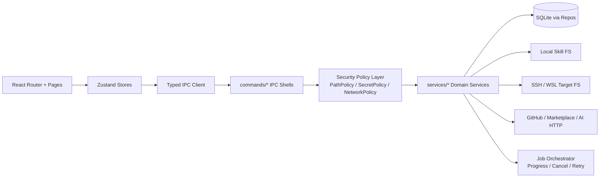

# skills-manage-windows 优化建议 Canvas

> 静态审计对象：`bahayonghang/skills-manage-windows`（SkillPort）。本 Canvas 聚焦可执行改进，不替代完整 CI / 本地构建 / 动态安全测试。

## 1. 系统画像

- 产品定位：Tauri v2 桌面应用，用于集中管理 AI coding agent skills、Central library、平台安装、Marketplace、GitHub import、SSH/WSL 远端目标。
- 技术栈：React 19 + TypeScript + Tailwind CSS 4 + Zustand；Rust + Tauri v2 + sqlx + SQLite；reqwest、keyring、tracing；pnpm / Cargo lockfile 均存在。
- 架构形态：React pages → Zustand stores → Tauri invoke/listen → `commands/*` IPC shell → `services/*` 业务服务 → `db/repos/*` / filesystem / remote target / network。
- 当前成熟度评分：**6.1 / 10**。
  - 加分：前后端均有类型检查/测试脚本；Rust 后端已有 commands/services/db 分层；敏感信息已引入 `SecretStore`；导入流程部分路径已有 staging/backup 设计。
  - 扣分：CI 只在 release published 触发；CSP 关闭且 Tauri capability 过宽；存在任意 path 读取/递归列目录 IPC；GitHub import 主路径覆盖非原子；资源上限和取消模型不统一。

## 2. 风险热力图

| 风险 | 级别 | 触发条件 | 主要证据 | 目标状态 |
|---|---:|---|---|---|
| Renderer IPC 任意 path 读文件/列目录/打开文件管理器 | P1 | Renderer 被 XSS/恶意状态/DevTools/供应链包控制 | `read_file_by_path`, `list_directory_tree`, `open_in_file_manager` 接收 path 并直达 FS/remote FS | 所有 path 操作经过 `PathPolicy` allowlist + canonicalize + size/depth cap |
| CSP 关闭 + capability 过宽 | P1 | 任意脚本执行或前端依赖被污染 | `csp: null`; `fs:default`, `shell:default`, `sql:default` | 严格 CSP；按 window/command 最小权限 |
| GitHub import overwrite 非原子 | P1 | 覆盖已存在 skill 且写入中途失败 | 主 import 路径先 `remove_dir_all(target_dir)` 再写入 | staging + backup + atomic rename + DB transaction 全路径统一 |
| CI 不保护 PR / push | P1 | 日常提交绕过 typecheck/lint/test/clippy | workflow 仅 `release.published` | PR/push 必跑 CI；release 只做包产物 |
| Tarball / tree / copy 无资源上限 | P2 | 大仓库、大目录或恶意 repo | archive 全量进内存，目录递归无深度/数量上限 | streaming + configurable caps + cancellation |
| README 安全说明过期 | P2 | 用户按旧文档评估威胁模型 | README 说 PAT/API key 存 SQLite 未加密，代码已用 `SecretStore` | 安全文档与实现一致，说明 keyring/DPAPI/session fallback |

## 3. 目标架构 Canvas

目标原则：

1. Renderer 不直接提交任意本地 path；只能提交 `skillId + relativePath`、`projectId + relativePath` 或后端签发的 opaque handle。
2. 所有文件、网络、secret、shell/open 操作都经过 policy 层；commands 只做参数解析与审计日志。
3. 大任务（import、scan、batch install、remote sync、tree listing）统一进入 job orchestrator，支持进度、取消、资源预算和幂等恢复。
4. DB 层以 repos + typed domain models 为边界，不让 `String` 状态值在业务层自由扩散。

## 4. 优先级问题清单

| ID | 级别 | 类型 | 位置 | 问题 | 直接修复 |
|---|---:|---|---|---|---|
| S-01 | P1 | 客观缺陷 | `src-tauri/src/commands/skills.rs`; `src-tauri/src/services/central_skills/files.rs` | IPC 暴露任意 path read/list/open，后端未校验根目录。 | 删除 `read_file_by_path(path)` 公共命令，替换为 `read_skill_file(skill_id, relative_path)`；目录树加 allowlist、maxDepth、maxEntries、maxBytes。 |
| S-02 | P1 | 客观缺陷 | `src-tauri/tauri.conf.json`; `src-tauri/capabilities/default.json` | CSP 关闭，权限过宽。 | 设置 CSP；移除 `fs:default` / `shell:default` / `sql:default`，按命令白名单化。 |
| D-01 | P1 | 客观缺陷 | `src-tauri/src/services/github_import/import.rs` | 主导入 overwrite 先删除目标目录，写失败不能恢复旧 skill。 | 让 `import_github_repo_skills_with_auth` 复用 `import_single_staged_skill` 的 staging/backup/restore 路径。 |
| E-01 | P1 | 客观缺陷 | `.github/workflows/ci.yml` | CI 只在 release published 触发，PR/push 无质量门禁。 | 增加 `pull_request` 和 `push` trigger；release workflow 只依赖已验证 commit。 |
| P-01 | P2 | 客观缺陷 | `archive.rs`; `types.rs`; `files.rs`; `fs_util.rs` | GitHub archive / 目录树 / copy 操作没有资源预算。 | 添加 archive/file/tree/copy caps，streaming extraction，取消令牌。 |
| A-01 | P2 | 架构债 | `src-tauri/src/lib.rs`; `commands/mod.rs`; `db/mod.rs` | IPC handler 和 DB re-export 面过大，db 注释显示 legacy split 未完成。 | handler registration 分组；DB repos 接管残余 query；删除临时 re-export/legacy 注释。 |
| T-01 | P2 | 代码质量 | `db/types.rs` | `status`, `link_type`, `source_kind` 等以 String 表达，容易产生非法状态。 | Rust enum + serde/sqlx 映射；DB CHECK constraint；边界转换。 |
| R-01 | P2 | 发布风险 | `tauri.conf.json`; README | Updater pubkey placeholder 与 `createUpdaterArtifacts=false` 需要验证 release 配置替换。 | release preflight：检查 pubkey 非 placeholder、artifact/signature/latest.json 完整。 |
| DOC-01 | P2 | 文档缺陷 | README; `secrets/*`; `settings.rs` | README 安全段与当前 SecretStore 实现不一致。 | 更新 Privacy & Security；说明 keyring、Windows DPAPI fallback、session-only fallback。 |
| W-01 | P3 | 健壮性/偏好 | `paths.rs` | Windows-first 应用优先 `HOME`，可能落到 Git Bash/MSYS home。 | Windows 下优先 `USERPROFILE`；或启动时显示 resolved app data path 并支持迁移。 |

## 5. 分阶段优化 Plan

### Phase 1 — Quick Wins（每项 < 1d）

1. **封堵任意 path IPC**
   - 动作：临时禁止 `read_file_by_path` 接收绝对路径；只允许当前 detail 返回的 `file_path` 或 Central/project/agent roots 下 canonical child。
   - 预期收益：将任意本地文件读取风险降为 allowlist 内读取。
   - 风险：部分 detail/raw-source UI 可能打不开历史记录中的路径。
   - 回滚：feature flag `safePathGuard=off`，仅 dev 可用。
   - 验收：读取 `~/.ssh/id_rsa`、`C:\Users\...\AppData` 等路径必须失败；合法 skill 文件可读。

2. **恢复基础 CSP 与最小 capability**
   - 动作：设置 `default-src 'self'; img-src 'self' asset: https: data:; style-src 'self' 'unsafe-inline'; connect-src 'self' https://api.github.com https://raw.githubusercontent.com ...`；分拆 capability。
   - 预期收益：降低 renderer compromise 概率与 blast radius。
   - 风险：第三方图标/Markdown 图片/AI stream 可能被 CSP 拦截。
   - 回滚：先以 report-only 日志观测，再强制。
   - 验收：打包产物 DevTools console 无 CSP violation；恶意 inline script 不执行。

3. **CI 触发修正**
   - 动作：`.github/workflows/ci.yml` 添加 `pull_request`、`push`；保留 release package smoke。
   - 预期收益：主分支前置发现 TypeScript/Rust regressions。
   - 风险：CI 成本增加。
   - 回滚：路径过滤或并发取消。
   - 验收：任意 PR 自动运行 typecheck/lint/test/sizecheck/cargo test/clippy。

4. **README 安全文档修正**
   - 动作：将“SQLite 明文存储”改为“系统凭据存储；Windows DPAPI app-local fallback；不可持久化时 session-only”。
   - 预期收益：用户威胁模型与实现一致。
   - 风险：需要准确描述各 OS fallback。
   - 回滚：标注“implementation note”并链接 issue。
   - 验收：README 与 `secrets/system.rs` 行为一致。

### Phase 2 — 中期重构（1–4 周）

1. **统一 GitHub import 原子写入路径**
   - 动作：删除直接写 target 的主路径；所有 import 使用 staging dir、backup、atomic rename、DB transaction。
   - 收益：覆盖失败时 RPO≈0。
   - 风险：跨卷 rename、Windows 文件锁。
   - 回滚：保留旧路径 behind feature flag 一版。
   - 验收：注入写失败后旧 skill 目录与 DB 完全恢复。

2. **PathPolicy / TargetFs 抽象**
   - 动作：`LocalTargetFs`, `SshTargetFs`, `WslTargetFs` 实现同一接口；`PathPolicy` 负责 roots、canonicalization、relative traversal、maxDepth/maxEntries。
   - 收益：安全策略集中，减少每个 service 自己判断。
   - 风险：涉及 skills/projects/obsidian/github_import 多模块。
   - 回滚：按 command 逐步迁移。
   - 验收：新增 fuzz/property tests 覆盖 `..`, symlink, UNC, Windows extended path。

3. **资源预算与取消模型**
   - 动作：archive extraction streaming；限制 archive bytes、file count、file size、tree entries；import/scan/batch install 全部接入 cancel token。
   - 收益：降低 OOM/卡死。
   - 风险：部分真实大仓库导入需调高预算。
   - 回滚：将 cap 变成 settings。
   - 验收：恶意 1GB tarball/10万文件目录不会 OOM，UI 可取消。

4. **Typed domain model + DB constraints**
   - 动作：`link_type`, `status`, `source_kind`, `target_kind` 转 enum；SQLite 添加 CHECK constraints；DB migration version table。
   - 收益：减少非法状态与字符串拼写 bug。
   - 风险：历史 DB 迁移。
   - 回滚：保留 unknown/legacy variant。
   - 验收：非法 link_type 插入失败；旧 DB 正常升级。

### Phase 3 — 长期架构演进（1–2 个版本）

1. **Command Registry 生成化**：从 Rust command metadata 生成 TypeScript IPC client、权限清单、文档和测试矩阵。
2. **平台适配器插件化**：每个平台声明 roots、project strategy、read-only source、install semantics，减少硬编码扩散。
3. **安全基线制度化**：CI 加 CodeQL/cargo-audit/pnpm audit、threat model、release signing preflight、sensitive log redaction tests。
4. **可观测性与诊断**：结构化 operation log schema、job timeline、失败分类、用户可导出的诊断包（默认脱敏）。

## 6. Before → Target 指标

| 指标 | 当前可见状态 | Target |
|---|---|---|
| PR/push CI | 未触发；release published 才跑 | PR/push 必跑，release 只打包 |
| CSP | `null` | 非空严格 CSP，生产无 inline script |
| 任意 path IPC | 存在 | 100% path 操作经 PathPolicy |
| 文件/目录资源上限 | 未见统一 cap | archive/file/tree/copy 全部有 cap + cancel |
| import overwrite RPO | 主路径可能丢旧目录 | 覆盖失败自动 rollback，RPO≈0 |
| Secret 文档准确性 | README 与实现冲突 | 文档与实现一致 |
| Rust/TS coverage | 未能验证 | Rust ≥70%，TS ≥75%，关键安全路径 90%+ |
| DB 非法状态防护 | 多处 String 状态 | enum + CHECK + migration tests |

## 7. 需要补充验证

- 精确 LOC、测试覆盖率、重复率、平均圈复杂度：当前连接器未提供递归 tree 和本地执行结果，需要 clone 后用 `tokei`, `cargo llvm-cov`, `vitest --coverage`, `scc`, `radon`/`complexity-report` 等计算。
- 依赖 CVE：需要运行 `cargo audit`, `pnpm audit`, `osv-scanner`。
- Release config：需要检查实际 release workflow 是否替换 updater public key、是否生成 `latest.json` 与签名。
- Markdown 渲染安全：需要继续审计 `SkillDetailView` / Markdown preview 是否启用 raw HTML、外链打开策略、图片来源策略。
