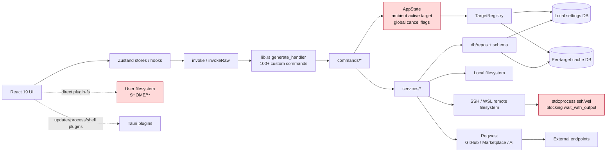
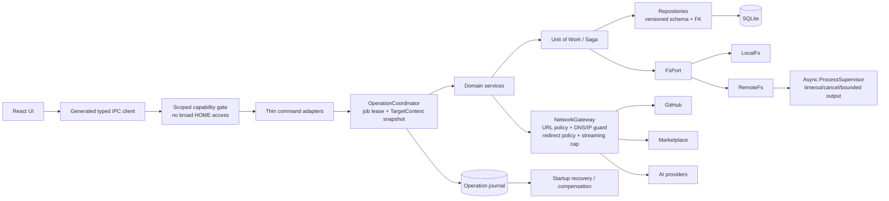

# SkillPort / skills-manage-windows 极度详细代码审计报告

- **仓库**：`bahayonghang/skills-manage-windows`
- **审计基准分支**：`main`
- **审计固定提交**：`35a317481bf9546bc53a7f01b9957a500e638726`
- **审计日期**：2026-07-24
- **审计方式**：GitHub 只读静态审计；按 README、目录/依赖、构建与 CI、入口、IPC、数据库、文件系统、GitHub 导入、SSH/WSL、发布链路逐层下钻并交叉验证
- **重要限制**：本次环境无法完整 clone 并实际执行 `pnpm test`、`cargo test`、打包、故障注入、CVE 扫描和覆盖率采集。因此所有运行时/依赖项结论均明确区分为“静态可证实”或“⚠️ 需验证”。

---

## 0. 执行摘要（TL;DR）

### 0.1 结论

这不是一个“小型 Tauri GUI”，而是一个具备较高系统权限、跨本机/SSH/WSL、多数据源导入、SQLite 缓存、更新器和发布流水线的桌面管理平台。它的代码基础并不差：归档安全、局部路径校验、Secret Store、Deep Link 解析、部分事务和本地跨进程 mutation lock 都有明确的安全意识。

但当前最严重的问题不是代码风格，而是**系统边界未统一**：

1. **活动 target、target cache DB、远端连接并非同一快照**，存在跨目标错配竞态。
2. **主 WebView 权限过宽**：可直接读写 `$HOME/**` 文本，并可调用大量敏感 custom commands，包括返回明文凭据的命令。
3. **GitHub Markdown 获取命令接受任意 URL**，底层缺少 URL/地址/redirect policy，构成 SSRF；同时请求无总超时，响应体先整体缓冲后检查大小。
4. **数据库没有关系完整性兜底，且全量扫描清理遗漏多张关系表**，可确定地产生 orphan rows。
5. **文件系统与数据库更新不是一个事务或可恢复 Saga**，删除/更新在中途失败时可留下不可自动恢复的 split-brain 状态。
6. **SSH/WSL 的 async API 内部使用同步 `std::process`**，没有命令级超时、kill-on-cancel 和输出上限，远端卡死可长期占用 Tokio worker。
7. **release workflow 在 GitHub Release 已经公开后才开始构建**，并且没有依赖 CI 成功；构建失败会留下已发布但缺失/不完整的 release。
8. **通用 `set_setting(s)` 能修改 target 配置和 active target key**，绕过专用命令里的存在性、探测和不变量校验。
9. **本地 GitHub preview 与 import 未绑定 commit SHA/content fingerprint**，用户确认的内容和实际写入内容可不一致。
10. **105 个前端 IPC 命令仍处于 untyped allowlist**，现有测试只检查“是否登记”，不检查 Rust/TypeScript 参数和返回类型是否匹配。

### 0.2 风险分布

| 级别 | 数量 | 结论 |
|---|---:|---|
| 🔴 P0 致命 | 0 | 未发现无需额外前置条件即可判定为远程接管/全量数据毁损的单点缺陷 |
| 🟠 P1 严重 | 10 | 建议作为下一正式 release 的阻断项 |
| 🟡 P2 中等 | 11 | 应在 1–2 个迭代内清零或建立明确风险接受 |
| 🟢 P3 轻微 | 3 | 主要是维护性、重复实现和工程规则债务 |

### 0.3 成熟度评分

**总体工程成熟度：5.8 / 10**

| 维度 | 评分 | 依据 |
|---|---:|---|
| 架构 | 5.8 | commands/services/targets/db 分层已经形成，但 ambient active target、FS/DB 双写、global cancel flag 破坏边界 |
| 安全 | 4.7 | 有 CSP、Keyring/DPAPI、归档校验、路径校验；但存在 SSRF、过宽 renderer authority、remote symlink boundary bypass |
| 稳定性 | 5.0 | 有 staging/rollback 和 WAL；但 remote process 无 hard timeout，跨目标和并发作业缺少 backend invariant |
| 工程化 | 5.7 | 有 `just ci`、lint/typecheck/clippy/test/sizecheck；但 PR 只在 Windows 跑完整 CI，release 与 CI 解耦，无自动 dependency audit/coverage gate |
| 代码质量 | 6.3 | 模块命名和错误类型总体清楚；仍有 105 个 untyped IPC、5 个 >800 行例外、SSH/WSL 重复实现 |
| 可观测性 | 5.5 | 有 operation log、tracing、运行日志；但 target identity 和错误细节存在丢失，缺少 operation/job correlation |
| 可维护性 | 6.0 | 文档较多、边界意识较强；但配置/文档漂移、schema migration 和 stringly settings 会持续放大变更成本 |

### 0.4 仓库概况

- **领域**：AI coding agent skill 管理桌面应用；本地/SSH/WSL target；GitHub/Marketplace/本地归档导入；Central library；SQLite metadata/cache；桌面发布与更新。
- **主要技术栈**：React 19、TypeScript、Zustand、Tauri 2、Rust 2021、Tokio、SQLx/SQLite、Reqwest、Keyring、GitHub Actions。
- **仓库体积**：GitHub metadata 显示约 `35,517 KB`；包含大量 docs/images，不能等同 LOC。
- **语言占比快照**：TypeScript 约 54%、Rust 约 39%，其余为 Python/JavaScript/CSS/HTML。
- **规模代理指标**：
  - 后端注册 custom commands 超过 100 个；
  - 前端有 **105 个** `UNTYPED_IPC_COMMANDS`；
  - 自有 size budget 为 800 行，但已有 5 个 production file frozen exception；
  - GitHub 页面显示 745 commits。
- **精确 LOC / 模块数**：⚠️ 本次只读连接器无法可靠统计；禁止把仓库体积或 GitHub 语言百分比伪装成 LOC。

### 0.5 最关键的 5 个风险

1. **跨 target split-brain**：A target 的连接对象可与 B target 的 cache DB 组合，导致跨目标读写、删除和日志错位。
2. **WebView 权限放大**：一旦 renderer 因 XSS、供应链依赖或 DevTools 注入被控制，攻击者可直接读写 HOME 文本、调用 destructive commands、读取 GitHub PAT/AI API key。
3. **SSRF + 无超时 + 整体缓冲**：任意 URL 可命中 localhost/LAN/metadata endpoint；chunked/no-content-length 响应可在 budget 检查前占用大量内存。
4. **持久化一致性缺失**：数据库 orphan、FS 已删但 DB 未删、文件已更新但 metadata/copy install 未更新。
5. **远端执行失控**：SSH/WSL 卡死时无 hard timeout、kill、bounded output；并发调用可阻塞 runtime worker。

---

## 1. 问题清单

> “性质”说明：
>
> - **客观缺陷**：由代码路径直接推导，可通过测试复现。
> - **设计债**：当前可能工作，但缺少必要架构约束，规模/并发扩大后失败概率显著上升。
> - **风险接受**：有合理产品/兼容性理由，但安全或稳定性代价必须被显式记录。
> - **风格偏好**：不直接构成功能缺陷，主要影响长期维护成本。

| ID | 级别 | 性质 | 维度 | 位置（file:line） | 证据 | 影响 / 二阶风险 | 根因 | 修复建议 | 工作量 | 信心 |
|---|---|---|---|---|---|---|---|---|---:|---|
| P1-01 | 🟠 | 客观缺陷 | 架构 / 健壮性 | `src-tauri/src/lib.rs:73-85`；`src-tauri/src/targets/registry.rs:359-411`；`src-tauri/src/commands/github_import.rs:21-88` | `active_target()` 与 `active_db()` 是两次独立读取；`active_db()` 内部再次解析 active target | target A 连接 + target B DB；跨目标删除、导入、更新、日志污染 | Ambient mutable context，没有 request-scoped snapshot | 引入 `TargetContext { id, target, db, fs }`，命令入口一次解析；in-flight operation 不受切换影响 | 2–4d | 高 |
| P1-02 | 🟠 | 客观缺陷 | 安全 / 权限模型 | `src-tauri/capabilities/default.json:6-24`；`src-tauri/src/lib.rs:352-500+`；`src-tauri/src/commands/settings.rs:326-337`；`src-tauri/src/commands/github_import.rs:133-137` | main WebView 获得 `$HOME/**` text read/write、`shell:default`；Tauri custom commands 默认对注册窗口可调用；存在明文 secret reveal commands | renderer compromise 可升级为用户文件读写、凭据泄露、destructive IPC | 把 renderer 当成完全可信；plugin permission 与 backend guard 并存两套边界 | 去掉 `$HOME/**`；文件 IO 全部后移；为 custom commands 建 explicit permissions/capabilities；删除或二次认证 reveal | 2–5d | 高 |
| P1-03 | 🟠 | 客观缺陷 | 安全 / 性能 | `src-tauri/src/commands/github_import.rs:91-115`；`src-tauri/src/services/github_import/raw_http.rs:41-96`；`src-tauri/src/services/github_import/pat.rs:38-48` | IPC 接收任意 `download_url`；非 raw GitHub URL 原样请求；Client 无 timeout/connect_timeout/redirect policy；`.bytes()` 后才检查大小 | SSRF 到 localhost/LAN/云 metadata；redirect 到私网；慢响应挂起；无长度响应导致内存峰值 | 网络边界只按“用途”命名，没有 URL policy | 限定 HTTPS + GitHub/raw allowlist；解析/解析后 IP 校验；每跳 redirect 校验或禁用；streaming cap；总/连接/读超时 | 1–3d | 高 |
| P1-04 | 🟠 | 客观缺陷 | 安全 / 路径边界 | `src-tauri/src/services/central_skills/files.rs:383-410,463-520`；`src-tauri/src/targets/exec.rs:348-377` | remote path 只做 lexical containment；仅检测最终路径是否 symlink；中间目录 symlink 会被 shell/`cat` 跟随 | 可从允许的 skill root 读取 root 外文件；路径 guard 名义存在但可绕过 | 缺少 remote `realpath`/canonical boundary | 在远端同时 `realpath -e root` 与 candidate；验证 candidate 为 root 自身或 child；逐层拒绝 symlink/按明确策略允许 root symlink | 2–3d | 高 |
| P1-05 | 🟠 | 客观缺陷 | 数据完整性 | `src-tauri/src/db/schema/collections.rs:10-39`；`src-tauri/src/db/repos/skills_repo.rs:574-697`；`src-tauri/src/services/scanner/persistence.rs:291-353` | 多张关系表无 FK；full-scan cleanup 遗漏 `collection_skills`、`skill_ai_tag_reviews`、`skill_explanations`；manual delete 非 transaction | orphan rows、旧 collection 自动“复活”、错误 cache 命中、后续 migration 失败 | 依赖应用层手工 cascade，表增加后清理链未同步 | 先 repair orphan，再加 FK + `ON DELETE CASCADE`；所有 delete 使用单 transaction；集中定义关系清理 | 2–5d | 高 |
| P1-06 | 🟠 | 客观缺陷 | 稳定性 / 一致性 | `src-tauri/src/services/central_skills/delete.rs:287-359,509-579`；`src-tauri/src/services/central_updates/core/batch.rs:28-145` | 删除先删 FS 后删 DB；update 先写目录、再逐条 DB persist、最后 refresh copies；失败无统一补偿；remote update 无 mutation guard | 文件/DB/copy install split-brain；重试不幂等；用户看到成功/失败与实际状态不一致 | 缺少跨资源 Unit of Work / Saga / operation journal | staging + DB transaction + commit marker；失败 restore；启动时 recovery；remote/local 使用同一 per-target operation lease | 4–8d | 高 |
| P1-07 | 🟠 | 客观缺陷 | 性能 / 健壮性 | `src-tauri/src/targets/runner.rs:27-72`；`src-tauri/src/targets/exec.rs:276-345,444-540+` | async 方法内部调用同步 `std::process::Command::output` / `wait_with_output`；无命令级 timeout、kill-on-drop、bounded stdout/stderr | SSH/WSL 命令卡死可长期占 worker；并发调用可拖死应用；取消标志无法终止 child | 用 async façade 包装 blocking runner | 改 `tokio::process::Command`；`tokio::time::timeout`；取消时 kill process tree；流式/有界收集 stdout/stderr | 3–6d | 高 |
| P1-08 | 🟠 | 客观缺陷 | 发布工程 / 供应链 | `.github/workflows/release-desktop.yml:3-7,315-344`；`.github/workflows/ci.yml:3-12,23-67` | release workflow 只在 `release.published` 后触发；publish job 只是向已存在 release 附件；CI 与 release workflow 并行、无依赖 | public release 可为空/残缺；CI 失败时仍可能发布 artifacts；更新器 metadata 不完整 | 发布动作与构建验证顺序反转 | tag/manual → reusable CI → build/sign/verify → create draft → attach → atomic publish；失败自动保持 draft | 1–2d | 高 |
| P1-09 | 🟠 | 客观缺陷 | 安全 / 配置管理 | `src-tauri/src/commands/settings.rs:17-29,117-140,370-451`；`src-tauri/src/targets/model.rs:2-4`；`src-tauri/src/targets/commands.rs:371-396` | generic setter 只保护两类 secret；可直接写 `ssh_targets_v1`、`wsl_targets_v1`、`active_target_id_v1` | 绕过 target 存在性、probe、ID immutable、credential/migration 逻辑；制造不可解析配置或指向错误 target | stringly key-value API 跨越 domain boundary | 只允许显式 UI preference allowlist；target/config key 只能通过专用 commands；schema validation + typed config | 1–3d | 高 |
| P1-10 | 🟠 | 客观缺陷 | 供应链 / 完整性 | `src-tauri/src/services/github_import/types.rs:4-69`；`src-tauri/src/commands/github_import.rs:51-88`；`src-tauri/src/services/github_import/import.rs:16-77` | preview model 只有 branch，无 commit SHA/content digest；local import 忽略 preview workspace 并重新 resolve/download branch | 用户确认 A，导入时 branch 已变成 B；审核 UI 不再构成安全承诺 | Preview/commit 两阶段没有 immutable artifact token | preview 返回 commit SHA + snapshot digest + expiring token；import 只消费该 snapshot；branch 仅作显示/后续更新线索 | 2–4d | 高 |
| P2-01 | 🟡 | 客观缺陷 | 并发 / 作业模型 | `src-tauri/src/lib.rs:53-64`；`src-tauri/src/services/central_updates/core.rs:62-149`；portable state commands/services | Central update 和 portability 各共享一个 `AtomicBool`；每个 producer 进入时 `store(false)`，无后端 “at-most-one” enforcement | 第二个 job 可清除第一个 job 的 cancel；一次 cancel 影响所有并发 job；状态事件互相覆盖 | cancel flag 不是 job registry / lease | `JobRegistry<JobId, CancellationToken>`；start 使用 CAS/lease；事件带 jobId；cancel 指定 job | 2–4d | 高 |
| P2-02 | 🟡 | 客观缺陷 | 安全 / 资源控制 | `src/components/central/CentralStatePortabilityDialog.tsx:184-218`；`src-tauri/capabilities/default.json:12-24` | renderer 直接 `readTextFile`/`writeTextFile`；读取后才交给 backend，前端无文件大小 cap | 选择超大/特殊文件可造成 UI 内存压力；绕开 backend extension/size/audit guard | 文件选择和文件访问未分离 | dialog 只返回 path；backend `open + metadata + extension + cap + streaming parse`；export atomic write | <1–2d | 高 |
| P2-03 | 🟡 | 设计债 | 数据库 / 演进性 | `src-tauri/src/db/schema/mod.rs:34-53`；`src-tauri/src/db/migrations.rs` | 以 `CREATE IF NOT EXISTS` + `PRAGMA table_info` + `ALTER` 演进，无统一 schema version、checksum、全局 migration transaction | 中途失败产生半迁移状态；无法审计版本；未来 FK/rebuild migration 难以回滚 | schema init 与 migration 混合 | 引入 `schema_migrations(version, checksum, applied_at)`；每个 migration 单 transaction；启动前 backup/restore | 3–7d | 高 |
| P2-04 | 🟡 | 客观缺陷 | CI / 跨平台 | `.github/workflows/ci.yml:23-67,69-187` | PR/push 完整 `just ci` 只跑 `windows-2022`；Linux/macOS package smoke 只在 release/manual 执行 | Unix-only compile error、shell/path/case/permission 问题可合并后才在 release 暴露 | Windows-first 目标被误当成只需 Windows 验证 | PR matrix 至少 `windows + ubuntu + macos` 的 check/test/build-no-bundle；package smoke 可 nightly | 1–2d | 高 |
| P2-05 | 🟡 | 客观缺陷 | 类型安全 / IPC | `src/lib/ipc/commandMap.ts:250-360`；`src/test/ipcCommandCoverage.test.ts:1-85` | 105 个命令在 `UNTYPED_IPC_COMMANDS`；测试只检查 literal name 是否在 map/allowlist，不校验 Rust signature/result | 参数 rename、camelCase、Option/null、错误 shape 漂移只在运行时暴露；敏感命令同样 untyped | 手工维护双端协议 | 使用 `specta`/`tauri-specta` 或自建 codegen；先迁 destructive/secret/import/update commands；CI 检查 backend parity | 5–10d | 高 |
| P2-06 | 🟡 | 客观缺口 | 供应链 / 安全工程 | `.github/workflows/ci.yml:29-52`；release workflow 多处 `uses: ...@vN` | Actions 使用可移动 major tags；CI 未见 `cargo audit/deny`、JS audit、CodeQL、secret scan、SBOM/attestation | 第三方 action/tag 被劫持或依赖高危漏洞不能阻断 release | CI 目标偏功能正确性，缺少 supply-chain gate | actions pin full SHA + Dependabot；`cargo deny/audit`；`pnpm audit --prod` 或 OSV；CodeQL；SBOM + provenance | 1–4d | 高 |
| P2-07 | 🟡 | 客观缺陷 | 启动健壮性 | `src-tauri/src/lib.rs:259-276` | 创建目录、打开 DB、初始化 schema 使用 `expect`；错误直接 panic | DB 损坏、权限/磁盘满会导致应用无法启动且无导出/修复入口 | 启动前置条件只有 fatal path | 启动状态机：正常 / read-only recovery / repair；备份 DB；向 UI 返回 structured fatal error | 2–4d | 高 |
| P2-08 | 🟡 | 客观缺陷 | 可观测性 | `src-tauri/src/commands/skill_update_inventory.rs`；`src-tauri/src/operation_log.rs` | 部分 update logs 把所有 SSH target 记为 `"ssh"`、WSL 记为 `"wsl"`，而通用 helper 已能记录真实 ID；部分错误 Display 过度泛化 | 多远端环境下无法定位事故；失败原因在审计日志中丢失 | 调用点绕过统一 helper；错误模型和日志模型未统一 | 强制使用 `target_context_from_active_target`；日志记录 stable error code + redacted detail + jobId | <1–2d | 高 |
| P2-09 | 🟡 | 客观缺陷 | 规则一致性 | `docs/reference/ipc-capability-inventory.md:21,63-75`；`src-tauri/capabilities/default.json:11` | 文档明确称 `shell:default` 已移除，但实际 capability 仍包含 | 安全审计依赖错误文档；后续维护者误判 renderer authority | 文档与配置无 drift check | 移除无用 permission；CI 解析 frontend plugin imports、capability、inventory 三方一致性 | <1d | 高 |
| P2-10 | 🟡 | 客观缺陷 | 性能 / 并发 | `src-tauri/src/central_migration.rs`；`src-tauri/src/lib.rs:317-349` | legacy central migration 作为 async task 启动，但内部使用 blocking FS；且没有与 Central mutation guard 协调 | 启动后导入/删除/迁移可与 legacy copy 竞争；大目录复制占 worker | “后台”被等同于“非阻塞”；migration 不属于 operation coordinator | `spawn_blocking` + 同一 per-target mutation lease；migration marker/恢复点；UI 禁止冲突操作 | 1–3d | 中 |
| P2-11 | 🟡 | 风险接受 | SSH 安全 | `src-tauri/src/targets/exec.rs:163-222` | `StrictHostKeyChecking=accept-new` | 首次连接仍存在 TOFU MITM；之后 host key change 会阻断 | 兼顾首次连接 UX | 首次展示 fingerprint 并要求确认；可选 managed `known_hosts`；企业模式支持预置 fingerprint | 2–4d | 中 |
| P3-01 | 🟢 | 客观规则债 | 可维护性 | `scripts/check-size-budget.mjs:6-18` | 800 行规则已有 5 个 frozen exception：861/1033/810/865/840 | review 粒度变差，冲突和回归面增大；规则变成“只防新增” | 历史大模块未建立拆分 owner/期限 | 每个 exception 建 issue、owner、deadline；按 domain/use-case 分解；目标全部 <600 行 | 3–10d | 高 |
| P3-02 | 🟢 | 风格偏好 | 可维护性 | `src-tauri/src/targets/exec.rs:276-620+` | SSH 与 WSL 大量重复：run/exists/inspect/mkdir/read/write/copy/remove/list | 修复 timeout、budget、path policy 时容易只改一侧 | transport-specific code 与 remote FS semantics 混合 | 抽 `RemoteProcess` + `RemoteFs`，共享脚本和 error mapping；保留 transport adapter | 3–5d | 中 |
| P3-03 | 🟢 | 设计债 | API / 错误处理 | 多个 `commands/*.rs`；`settings` key-value API | IPC 广泛返回 `Result<T, String>`；settings/operation 名称大量 string literal | 前端无法稳定按 error code 分支；重构容易产生 silent drift | IPC boundary 过早 stringify | `IpcError { code, message, retryable, details }`；domain error 到 IPC error 单点映射 | 5–10d | 高 |

---

## 2. 关键问题深挖

### 2.1 P1-01：Active target 与 active DB 的 split-brain race

#### 证据链

1. `AppState.active_target()` 与 `AppState.active_db()` 是两个公开 async 方法，分别解析状态。
2. `TargetRegistry.active_db()` 内部再次调用 `active_target()`。
3. GitHub import 等 command 先 `state.active_target().await`，随后再 `state.active_db().await`。
4. `set_active_target` 是另一个可并发执行的 IPC command，Tauri 后端没有 operation-wide target lease。

#### 可复现场景

```text
T0: import command 读取 active target = SSH-A
T1: 用户切换 active target = SSH-B
T2: import command 调用 active_db()，得到 SSH-B cache DB
T3: service 使用 SSH-A connection + SSH-B metadata/cache
```

同类风险适用于 update、delete、portable state、scanner、settings/logging 等同时需要 target 和 DB 的路径。

#### 影响

- SSH-A 上的文件被修改，但 SSH-B DB 被更新；
- 删除预览来自一个 target，执行落到另一个 target context；
- operation log 记录错误 target；
- cache 进入无法通过普通 rescan 完全修复的状态；
- 极端情况下，本地 target 与 remote cache 组合，生成在本机不可用或意外的路径。

#### 最强反驳

“UI 切换 target 时通常会禁用当前页面，用户不太可能在操作中途切换。”

#### 结论

这个反驳不足。**跨 target 一致性必须是 backend invariant，而不是 UI timing invariant**。DevTools、重复窗口、事件重入、未来并发功能或 bug 都能绕过 UI 限制。

#### 目标设计

```rust
pub struct TargetContext {
    pub id: TargetId,
    pub target: ActiveTarget,
    pub db: DbPool,
    pub fs: CentralFs,
    pub generation: u64,
}

impl AppState {
    pub async fn resolve_target_context(&self) -> Result<TargetContext, AppError>;
}
```

每个 command 在入口只调用一次，并把 context 传到 service。切换 target 只影响后续 command，不改变 in-flight context。

#### 验收测试

- 在 `active_target` 与 `active_db` 之间设置 barrier；
- command 开始于 A；
- barrier 后切换 B；
- 断言所有 FS、DB、log、event payload 均仍为 A；
- 对 local↔SSH、SSH-A↔SSH-B、WSL-A↔WSL-B 做参数化测试。

---

### 2.2 P1-02：主 WebView 是高权限单点

#### 证据链

- capability 允许 `fs:allow-read-text-file`、`fs:allow-write-text-file`，scope 包含 `$HOME/**`。
- capability 仍包含 `shell:default`。
- portability UI 直接调用 plugin-fs。
- backend 注册大量 destructive/import/update/settings commands。
- Tauri v2 对 `invoke_handler` 注册的 app commands 默认允许已注册窗口调用，除非建立 app-specific permissions/capability 限制。
- `reveal_ai_api_key` 与 `reveal_github_pat` 返回明文 secret。

#### 风险模型

目前没有发现 `react-markdown` raw HTML 注入；这是一项正面证据。但权限模型不应只针对“当前已知 XSS”。Renderer compromise 还可能来自：

- 新增不安全 Markdown/HTML renderer；
- npm 供应链；
- Tauri/WebView 漏洞；
- DevTools/本机恶意软件注入；
- 未来 remote content preview；
- 错误的 `window.eval`/URL navigation。

一旦发生，攻击者不需要再寻找 Rust 漏洞：可直接调用现有 IPC 或 plugin-fs。

#### 最强反驳

“桌面应用本来就在用户权限下运行，用户自己也能读 HOME。”

#### 结论

桌面进程和 WebView 不是同一信任层。Tauri capability 的目的正是限制 WebView compromise 的 blast radius。当前 `$HOME/**` 使 capability 约束几乎失去意义。

#### 修复顺序

1. 删除 `$HOME/**`，只保留专用 app data/export temp scope；
2. portability import/export 改 backend command，dialog 只选择路径；
3. 移除未用 `shell:default`；
4. 为 destructive、secret、target/config commands 建 explicit custom permissions；
5. secret UI 默认只显示 masked state；reveal 要求 fresh user gesture/OS authentication，或完全不返回明文；
6. CI 建 capability drift test。

---

### 2.3 P1-03：SSRF、redirect 与 response buffering

#### 证据链

`fetch_github_skill_markdown(download_url)` 把前端字符串传给 `fetch_raw_text`。底层：

```rust
if let Some(path) = raw_url_to_repo_path(url) {
    raw_file_url(endpoint, ...)
} else {
    url.to_string()
}
```

也就是说，只要 URL 不是标准 `raw.githubusercontent.com` 形式，就直接请求原 URL。没有检查：

- scheme；
- host allowlist；
- localhost/private/link-local/multicast/IPv6 ULA；
- URL userinfo；
- non-default port；
- redirect target；
- DNS 解析结果；
- DNS rebinding；
- proxy route。

`github_client()` 只设置 user-agent。Reqwest async Client 默认没有总 request timeout、没有 connect timeout，并默认跟随最多 10 次 redirect。响应体通过 `.bytes().await` 整体读入后才执行 size budget。

#### 攻击/故障样例

应由测试拒绝：

```text
http://127.0.0.1:...
http://[::1]:...
http://169.254.169.254/...
https://public.example/redirect-to-127.0.0.1
https://host-that-resolves-to-10.0.0.5/...
file://...
ftp://...
https://github.com.evil.example/...
```

#### 修复

- 该 command 实际用途若只为 GitHub preview，最安全方案是**不接受 URL**，只接受 `{repo, commit_sha, source_path}`。
- 若必须支持 URL：
  - parse 后只允许 `https`；
  - strict host allowlist；
  - reject credentials、fragment、非标准 port；
  - resolve DNS，拒绝 private/loopback/link-local/unspecified/multicast；
  - `redirect::Policy::none()`，或每跳重新执行完整 policy；
  - `connect_timeout(5s)`、`timeout(20–30s)`、read idle timeout；
  - `bytes_stream()` 累积，超过 cap 立即 abort；
  - 不向非 GitHub endpoint 发送 bearer token；
  - 记录 destination host、status、bytes、duration，但不记录 query/token。

---

### 2.4 P1-04：Remote lexical path guard 可被中间 symlink 绕过

#### 当前实现

- `normalize_remote_skill_path` 拒绝 `..` 和反斜杠；
- candidate 必须 lexical `starts_with(root)`；
- `inspect_path(candidate)` 只判断 candidate 最终对象是否 symlink；
- `cat candidate` 会解析所有中间 symlink。

#### 绕过模型

```text
allowed root: /home/u/.skillsmanage/skills/demo
/home/u/.skillsmanage/skills/demo/docs -> /etc
requested: /home/u/.skillsmanage/skills/demo/docs/passwd
```

最终 `/.../docs/passwd` 本身不是 symlink，`test -L "$p"` 为 false，但 `cat` 会读取 `/etc/passwd`。

#### 修复

远端脚本必须原子执行：

```sh
root_real=$(realpath -e -- "$root") || exit ...
candidate_real=$(realpath -e -- "$candidate") || exit ...
case "$candidate_real" in
  "$root_real"|"$root_real"/*) ;;
  *) exit PATH_ESCAPE ;;
esac
```

同时明确产品策略：

- 允许 skill root 自身是 agent install symlink；
- 默认拒绝 skill root 内部的 symlink；
- 若允许内部 symlink，也必须要求其 realpath 仍在 root 内。

测试覆盖 final symlink、intermediate symlink、root symlink、broken symlink、case sensitivity、newline/tab path。

---

### 2.5 P1-05：数据库完整性不是“偶发风险”，而是可复现缺陷

#### 可确定的遗漏

`delete_skill()` 会清理：

- `skill_update_states`
- `skill_repository_members`
- `collection_skills`
- `skill_tag_links`
- `skill_ai_tag_reviews`
- `skill_explanations`
- `skill_installations`
- `skills`

但 `delete_skills_not_in_scope()` 与 scanner full reconciliation 未同步新增表，遗漏：

- `collection_skills`
- `skill_ai_tag_reviews`
- `skill_explanations`

关系表又没有 FK，因此 SQLite 不会阻止 orphan。

#### 二阶风险

- 删除 skill 后重新导入同 ID，会继承旧 collection；
- AI explanation/cache 对新内容错误命中；
- AI review queue 出现不存在 skill；
- 未来添加 FK migration 时因 orphan 导致 migration 失败；
- export/backup/统计结果被污染；
- 测试若只使用 inner join，问题长期隐藏。

#### 修复迁移

1. 运行 orphan inventory：
   ```sql
   SELECT ... FROM collection_skills cs
   LEFT JOIN skills s ON s.id = cs.skill_id
   WHERE s.id IS NULL;
   ```
2. 决定 repair policy：删除 orphan；必要时先导出审计 JSON。
3. 用 table rebuild 增加 FK：
   ```sql
   FOREIGN KEY(skill_id) REFERENCES skills(id) ON DELETE CASCADE
   ```
4. 每个 DB connection 开启并验证 `PRAGMA foreign_keys = ON`。
5. 删除逻辑只删除 `skills` 主记录，让 DB cascade。
6. 加 `PRAGMA foreign_key_check` 到 startup diagnostics/CI tests。
7. 对 full scan、single delete、batch delete、cancel、DB error injection 做测试。

---

### 2.6 P1-06：FS + DB 双写缺少可恢复协议

#### 当前失败窗口

**删除：**

```text
remove installation paths
remove central directory
DELETE relation rows / skill row
```

若最后 DB 操作失败，目录已经不可逆删除。

**更新：**

```text
atomic write skill dirs
DB upsert / repository assignment
refresh copied installations
```

“单个目录 atomic write”不等于“整个业务操作 atomic”。DB 或 copy refresh 失败后，source 与 metadata/installed copies 不一致。

#### 最强反驳

“文件系统和 SQLite 无法做真正分布式事务，完全原子不现实。”

#### 结论

正确。但这不意味着只能接受 split-brain。应采用可恢复 Saga / operation journal。

#### 建议协议

```text
1. validate + plan
2. write operation_log(status=prepared, operation_id, target_id, old/new fingerprints)
3. stage FS changes / backups
4. begin DB transaction
5. apply DB changes
6. swap staged FS
7. commit DB
8. refresh dependent copies
9. mark completed
```

若步骤 6/7 不能安全排序：

- 使用 durable journal；
- 每一步幂等；
- 启动时扫描 `prepared/applying` operation；
- 根据 marker 完成或回滚；
- 保留有限期 backup。

Remote target 必须使用 per-target lease；不能只给 Local `CentralFs` 加锁。

---

### 2.7 P1-07：远端执行层会阻塞 async runtime

#### 证据

`CommandRunner::run` 使用：

- `.output()`
- `.spawn()`
- `stdin.write_all`
- `.wait_with_output()`

上层 `run_script`/`run_command` 被声明为 `async`，但没有 `spawn_blocking`，也没有 `tokio::process`。这属于“async signature，blocking implementation”。

SSH `ConnectTimeout=10` 只约束连接阶段；远端 `find`、`cp`、`cat`、shell script 执行可无限期等待。

#### 影响

- 一个 hung command 占一个 Tokio worker；
- 多个 IPC 并发可使 runtime 饥饿，UI 中其他 commands/event 无响应；
- cooperative cancel 只在迭代间检查，不能终止正在运行的 child；
- `wait_with_output` 无上限收集 stdout/stderr；
- child/ssh 可能在应用关闭后继续存活。

#### 修复架构

```rust
struct ProcessSupervisor {
    default_timeout: Duration,
    output_limit: usize,
}

async fn run(
    &self,
    spec: CommandSpec,
    cancel: CancellationToken,
) -> Result<BoundedOutput, ProcessError>;
```

要求：

- `tokio::process::Command`;
- `kill_on_drop(true)`;
- `select!` 监听 child、timeout、cancel；
- Windows 使用 Job Object 或 process-tree kill；
- stdout/stderr 流式读取并有 cap；
- 每个 command 定义 timeout class；
- timeout/cancel 返回 stable error code；
- metrics：command name、target id、duration、exit、bytes。

---

### 2.8 P1-08：Release 的状态机顺序反了

#### 当前顺序

```text
人工发布 GitHub Release
    ↓ release.published event
CI workflow 开始
Release Desktop workflow 开始
    ↓
build
    ↓
向已发布 release 上传附件
```

如果 CI/build/signing 失败，release 已经是 public。该 workflow 的 `publish` job 名称容易给人“最后才 publish”的错觉，但实际上只是更新一个已经发布的 release。

#### 目标顺序

```text
tag / workflow_dispatch
    ↓
reusable CI（必须成功）
    ↓
build matrix
    ↓
sign + verify + updater metadata integration test
    ↓
create/update draft release
    ↓
download artifacts and verify checksums
    ↓
atomic publish
```

必要 guard：

- version/tag/package/Cargo/tauri config 一致；
- Windows updater signature 验证；
- macOS signing/notarization policy 明确；
- Linux packages smoke install；
- `latest.json` URL、signature、version、platform keys 验证；
- release artifacts manifest + SHA256；
- failure 时 release 保持 draft。

---

### 2.9 P1-09：Generic settings API 绕过 domain invariants

`set_setting_impl` 只拒绝 empty key 和 GitHub/AI secret key，其他 key 全部可写。与此同时，target subsystem 把以下关键状态也存为普通 settings：

```text
ssh_targets_v1
wsl_targets_v1
active_target_id_v1
```

专用 `set_active_target_impl` 会验证 target 存在；专用 create/update 会校验字段、ID immutable、auth mode、probe 和 credential。通用 setter 能绕过这些逻辑。

#### 修复

- generic settings 只接受 enum/allowlist：
  ```rust
  enum UserPreferenceKey {
      Theme,
      Language,
      ...
  }
  ```
- target keys、migration markers、security settings、feature gates 不能通过 generic API；
- batch setter 在一个 DB transaction 中做 typed validation；
- 启动时对已有 target JSON 做 schema validation 和 quarantine；
- operation log 记录 key category，不记录 value。

---

### 2.10 P1-10：Preview 与 Import 没有 immutable binding

`GitHubRepoRef` 只有 `owner/repo/branch/normalized_url`。本地 import 重新：

1. resolve URL/branch；
2. 调 Tree API 或重新下载 archive；
3. 根据当前内容构造 candidates；
4. 用 preview 时提交的 `source_path + resolution` 执行。

branch 在两次调用间可变化。即使不是恶意攻击，也会造成用户确认内容与导入内容不一致。

#### 修复

Preview 返回：

```text
preview_id
resolved_commit_sha
snapshot_sha256
candidate file manifest + per-file digest
expires_at
```

Import 只接受 `preview_id + selections`，不能再接受原始 URL 重新拉取。若 snapshot 过期，要求重新 preview。后续 update 可继续跟踪 branch，但 initial install 必须记录 commit SHA 和 content digest。

---

## 3. 架构评估

### 3.1 当前架构图



### 3.2 当前主要反模式

| 反模式 | 当前表现 | 后果 |
|---|---|---|
| Ambient Context | command 随时读取 mutable active target | request 内 target 不稳定 |
| Split-Brain Persistence | FS 与 DB 分步写，无 durable journal | partial failure 后不可自动恢复 |
| Privileged Renderer | direct plugin-fs + broad custom command access | renderer compromise blast radius 过大 |
| Async Façade over Blocking Core | async fn 内同步 process wait | runtime starvation、cancel 无效 |
| Manual Referential Integrity | 无 FK，手工 cascade 分散 | 新表加入后清理遗漏 |
| Stringly Typed Control Plane | setting keys、IPC errors、operation names | invariant 绕过、双端 drift |
| Global Cancellation Flag | 一个 AtomicBool 代表所有 job | 并发 job 相互干扰 |
| Mutable Source Preview | branch URL 代替 immutable snapshot | preview/commit TOCTOU |
| Release-after-Publish | public release 触发构建 | broken/empty release 可见 |

### 3.3 目标架构



### 3.4 推荐依赖方向

```text
UI
  ↓ generated IPC types
Command adapters
  ↓
Application use cases / OperationCoordinator
  ↓
Domain policies
  ↓
Ports: Repository / FsPort / NetworkGateway / SecretStore / Clock
  ↓
Adapters: SQLite / LocalFs / SSH / WSL / Reqwest / Keyring
```

禁止方向：

- domain service 读取 ambient active target；
- frontend 直接读写任意 user files；
- command 直接拼 settings key；
- remote adapter 直接操作 DB；
- DB repo 依赖 UI/tauri event；
- infrastructure error 在所有层提前变成 `String`。

---

## 4. 已做得较好的部分

这些不是“礼貌性表扬”，而是有代码证据、值得保留的设计：

### 4.1 Local archive 安全矩阵较完整

`services/local_archive_import/inventory.rs` 对 ZIP/TAR 做了：

- absolute path / `..` / backslash / UNC 检查；
- symlink、encrypted、unsupported method 拒绝；
- case collision、prefix collision；
- file count、expanded bytes、entry bytes、compression ratio；
- preview fingerprint；
- import 时重新验证 fingerprint；
- staging/backup/swap 和失败恢复。

这是当前仓库最成熟的安全边界之一。后续 GitHub import、portable state、Marketplace 应复用同一套“preview token + fingerprint + budget + staging”模型。

### 4.2 Local skill file boundary 有 canonicalization

`central_skills/files.rs` 本地路径会 canonicalize root 与 candidate，验证 containment，并有 symlink escape tests。问题主要在 remote 版本没有达到同等语义，而不是整个项目都没有路径意识。

### 4.3 Deep Link parser 严格

`services/deep_link/mod.rs` 有：

- 4096-byte cap；
- strict scheme/action/authority/path；
- source 必须 percent-encoded；
- 只允许 HTTPS GitHub；
- 拒绝 credentials/port/query/fragment；
- 多层 decode 与 traversal 检查；
- bounded pending queue。

这是正确的“先缩小语法，再解析，再 normalize”的实现方式。

### 4.4 Secret storage 与 SSH askpass 方向正确

GitHub PAT/AI key 已向 SecretStore 迁移；SSH password 使用 credential backend/Windows protected fallback；askpass helper 临时文件权限和清理路径也有处理。应保留 secure storage，但收紧“renderer 可明文 reveal”。

### 4.5 Scanner persistence 使用 transaction

`persist_scan_batch` 对 upsert、keep tables、stale cleanup 使用同一 SQL transaction。这说明团队已经具备 transaction 意识；问题是 stale table 集合不完整和缺少 FK。

### 4.6 Local Central mutation lock 有跨进程意识

`central_mutation` 使用 `fs2` file lock，并把 blocking lock acquisition 放入 blocking pool。这个机制应演进为 per-target `OperationCoordinator`，而不是删除。

### 4.7 CSP 与 Markdown 默认路径相对保守

当前 Markdown renderer 使用 `react-markdown` + GFM，没有接入 raw HTML plugin；CSP 的 `script-src 'self'` 也没有 `'unsafe-inline'`。因此本次没有把“现存 Markdown XSS”列为已证实缺陷。

---

## 5. 优化 Plan

## 阶段一：Quick Wins（每项目标 <1d）

### QW-01 立即封堵任意 URL SSRF

- **动作**：`fetch_github_skill_markdown` 只接受 `raw.githubusercontent.com` HTTPS URL，或更好地改成 repo/commit/path；Client 增加 timeout，禁用 redirect；改 streaming cap。
- **量化收益**：任意 destination surface `1 → 0`；无 hard timeout request `1 → 0`。
- **风险**：非标准 mirror/自定义 URL 可能失效。
- **回滚策略**：保留 feature flag，仅允许显式配置并通过同一 URL policy。
- **验收**：localhost、private IPv4/IPv6、redirect-to-private、chunked oversized 全部被测试拒绝。

### QW-02 删除 `$HOME/**` 与未用 `shell:default`

- **动作**：capability 只保留 app-specific export/import path；portability 暂时限制到 app export dir。
- **量化收益**：renderer 可直接读写 HOME 的范围从“全 HOME”降至“0”。
- **风险**：用户任意目录导入导出 UX 受影响。
- **回滚策略**：backend command 接收 dialog-selected path，恢复 UX 而不恢复 broad permission。
- **验收**：Tauri capability tests 证明 HOME 非授权路径被拒绝。

### QW-03 修复 DB stale cleanup 遗漏

- **动作**：在 scanner/full reconciliation 和 `delete_skills_not_in_scope` 中补齐三张表；所有 delete 放进 transaction。
- **量化收益**：已知 orphan source `3 → 0`。
- **风险**：历史 orphan 被删除，可能暴露旧数据依赖。
- **回滚策略**：修复前导出 orphan audit JSON。
- **验收**：删除 skill 后所有 relation count 为 0；故障注入时 transaction rollback。

### QW-04 Backend 拒绝并发同类 job

- **动作**：在正式 JobRegistry 前，用 CAS/mutex lease 让 update/portability 同类 job 同时最多一个。
- **量化收益**：共享 cancel flag 的并发写者从 `N → 1`。
- **风险**：用户收到 “job already running”。
- **回滚策略**：只回滚 UI 文案，不回滚 backend invariant。
- **验收**：并发发起两个 job，第二个稳定返回 structured busy error。

### QW-05 Release 先构建后公开

- **动作**：release workflow 改 `workflow_dispatch`/tag push；先 build，最后创建/发布 draft release。
- **量化收益**：public-but-empty release 概率从“构建失败时必然可能”降为 0。
- **风险**：现有发布操作流程变化。
- **回滚策略**：保留手动 dispatch，文档化一键发布。
- **验收**：任一 matrix job 失败时不存在新的 public release。

### QW-06 Capability inventory drift check

- **动作**：CI 比较实际 capability、frontend plugin imports 和 inventory 文档。
- **量化收益**：已知 drift `1 → 0`。
- **风险**：CI 初期会因文档差异失败。
- **回滚策略**：先 warning 一周，再变 required。
- **验收**：新增 plugin permission 未更新 inventory 时 CI fail。

### QW-07 修复 operation log target identity

- **动作**：所有调用使用统一 target context helper，记录实际 target ID/label。
- **量化收益**：remote operation 可归属率从不确定提升至 100%。
- **风险**：历史 dashboard 按 `"ssh"` 聚合逻辑需迁移。
- **回滚策略**：保留 `kind=ssh` 字段，同时新增 `target_id`。
- **验收**：两个 SSH target 的日志可明确区分。

### QW-08 Supply-chain baseline

- **动作**：Actions pin full SHA；加入 Dependabot for github-actions；CI 增加 `cargo audit/deny` 和 JS/OSV audit。
- **量化收益**：mutable action reference `>0 → 0`；自动审计生态 `0 → 2`。
- **风险**：已有 advisories 可能阻塞 CI。
- **回滚策略**：允许带 owner/expiry 的 temporary exception，不允许 silent ignore。
- **验收**：高危/严重 advisory 无 exception 时 release fail。

---

## 阶段二：中期重构（1–3 周）

### M-01 Request-scoped `TargetContext`

- **前置依赖**：无；优先级最高。
- **动作**：统一解析 target、DB、FS adapter、operation log context；所有敏感 use case 改显式参数。
- **预期收益**：跨 target mismatch path `>多处 → 0`；测试可注入固定 context。
- **风险**：command/service signature 大面积变化。
- **回滚策略**：先增加新 API，旧 `active_target/active_db` 标 `deprecated`，逐模块迁移。
- **验收**：生产代码中除 context resolver 外不再调用 `state.active_target()`/`state.active_db()` 组合。

### M-02 Async ProcessSupervisor

- **前置依赖**：TargetContext。
- **动作**：统一 SSH/WSL child lifecycle、timeout、cancel、bounded output、process tree kill。
- **预期收益**：blocking child wait `100% → 0%`；remote command timeout coverage `0% → 100%`。
- **风险**：Windows process termination 和 askpass 行为变化。
- **回滚策略**：feature flag 选择 legacy runner；保留相同 command builder。
- **验收**：fake never-exit process 在 deadline 后被 kill；Tokio worker 可继续处理其他 command。

### M-03 Remote canonical path boundary

- **前置依赖**：RemoteFs 抽象。
- **动作**：realpath root/candidate；统一 local/SSH/WSL path policy。
- **预期收益**：已知 intermediate symlink escape `1 → 0`。
- **风险**：现有合法 skill 内部 symlink 可能被拒绝。
- **回滚策略**：提供 “allow internal symlink only if resolved target remains under root” 模式。
- **验收**：symlink matrix 全平台一致。

### M-04 Versioned schema + FK

- **前置依赖**：orphan quick fix。
- **动作**：migration version/checksum；relation FK cascade；foreign key check；DB backup。
- **预期收益**：应用层 cascade SQL 大幅减少；orphan invariant 由测试约束升级为 DB 约束。
- **风险**：SQLite table rebuild 和旧 DB migration。
- **回滚策略**：迁移前原子备份；失败自动恢复；保留旧 binary compatibility window。
- **验收**：从最近 N 个发布版本 fixture 升级成功；`foreign_key_check` 为空。

### M-05 Operation journal / Saga

- **前置依赖**：TargetContext、versioned schema。
- **动作**：为 import/update/delete/store migration 记录 durable operation 和 compensation。
- **预期收益**：crash 后人工修复需求显著下降；重试变幂等。
- **风险**：状态机复杂度上升。
- **回滚策略**：先用于 delete/update 两条最高风险路径；journal schema 向后兼容。
- **验收**：在每个 step 注入 crash，重启后能完成或回滚，且最终 invariant 一致。

### M-06 Typed IPC code generation

- **前置依赖**：统一 `IpcError`。
- **动作**：从 Rust types 生成 TS client；逐步消除 105-entry allowlist。
- **预期收益**：untyped commands `105 → 0`；参数/返回 drift 在编译期发现。
- **风险**：序列化 naming 和 existing UI types 冲突。
- **回滚策略**：新 client 与旧 adapter 并行；按 domain 迁移。
- **验收**：CI 自动比较 handler registry 与 generated commands；allowlist 空。

### M-07 Settings domainization

- **前置依赖**：typed IPC。
- **动作**：拆成 `UserPreferencesService`、`TargetConfigService`、`SecurityConfigService`；禁止 arbitrary key。
- **预期收益**：generic key bypass `1 → 0`。
- **风险**：大量前端调用迁移。
- **回滚策略**：generic getter 可暂留只读，setter 先 allowlist。
- **验收**：尝试写 target/migration/security key 返回 `SETTING_KEY_FORBIDDEN`。

---

## 阶段三：长期架构演进（1–3 月）

### L-01 Per-target Actor / OperationCoordinator

- **动作**：每个 target 一个串行 mutation queue；read operations 可并发；job/cancel/progress 按 ID 管理。
- **收益**：同一 target destructive race 从结构上消失；跨 target 可安全并行。
- **风险**：调度和 UI 状态模型变化。
- **回滚**：先只包 mutation use case。
- **验收**：并发 stress test 下无 FS/DB invariant violation。

### L-02 Content-addressed import provenance

- **动作**：所有 GitHub/Marketplace/archive import 使用 immutable digest；存 commit SHA、manifest、source digest、imported digest。
- **收益**：可复现安装、审计、rollback、供应链追踪。
- **风险**：DB 与 UI 模型扩展。
- **回滚**：字段 nullable，旧数据标 provenance unknown。
- **验收**：同一 provenance token 重放得到相同文件树 digest。

### L-03 Release provenance 与平台签名

- **动作**：SBOM、artifact attestation、checksum manifest；Windows Authenticode、macOS Developer ID/notarization；Linux signing policy。
- **收益**：用户可验证 publisher 和 artifact provenance。
- **风险**：证书/成本/secret 管理。
- **回滚**：先 attestation + checksum，再分平台启用 OS signing。
- **验收**：安装包在目标 OS 上通过 publisher/notarization 验证；release manifest 可离线验证。

### L-04 可观测性标准化

- **动作**：所有 operation 带 `operation_id/job_id/target_id/phase/error_code/duration/bytes`；建立 health diagnostics。
- **收益**：远端故障、取消、partial failure 可定位。
- **风险**：日志 schema migration。
- **回滚**：兼容读旧 schema。
- **验收**：任一失败可从单个 operation ID 串联 command、network、process、DB、FS 阶段。

### L-05 模块体量与依赖治理

- **动作**：拆 5 个 frozen exception；用 dependency graph/layer test 防止反向依赖；引入 architecture decision records。
- **收益**：review 变更面和 merge conflict 降低。
- **风险**：纯重构回归。
- **回滚**：小 PR、golden tests、保持 public API。
- **验收**：production file >800 行为 0；domain service 不依赖 Tauri/React。

---

## 6. 量化指标（Before → Target）

| 指标 | Before | 近期 Target | 长期 Target |
|---|---:|---:|---:|
| 已确认 P1 | 10 | 0（下一正式 release 前） | 0 |
| Renderer broad HOME text scope | `$HOME/**` | 0 | 0 |
| 明文 secret reveal commands 对主 WebView 可用 | 2 类 | 默认不可用 | 0 或 OS-auth gated |
| 任意 URL backend fetch surface | 1 | 0 | 0 |
| Network total timeout coverage | 部分/关键 GitHub client 为 0 | 100% external requests | 100% + per-operation SLO |
| Response streaming size cap | 关键 raw fetch 为 post-buffer check | 100% | 100% |
| Remote command hard timeout | 0% | 100% | 100% |
| Remote child cancellation/kill | 0% | 100% | 100% |
| Request-scoped target snapshot | 0% 敏感 command | 100% P1 flows | 100% |
| Per-target mutation serialization | Local 部分有；Remote 缺失 | 100% destructive flows | actor/queue |
| 已知 stale cleanup 遗漏表 | 3 | 0 | 0 |
| DB FK coverage | 低/关系表普遍缺失 | 核心关系 100% | 全部关系 100% |
| `PRAGMA foreign_key_check` violations | 未测量 | 0 | 0 |
| Cross-resource operations 有 journal/compensation | 近似 0% | delete/update/import 100% | 所有 mutation 100% |
| Untyped IPC commands | 105 | <20 | 0 |
| PR full CI OS | 1/3（Windows） | 3/3 compile/test | 3/3 + packaged E2E |
| 自动 dependency security audit ecosystems | 0 | 2 | 2 + policy/attestation |
| Test coverage | 未测量 | TS ≥80% line；Rust ≥75% line | critical branch ≥90% |
| Critical path fault-injection tests | 极少/未形成 gate | delete/update/import/remote | 全 mutation state machine |
| >800 行 production exceptions | 5 | ≤2 | 0 |
| Actions full-SHA pinned | 多数未 pin | 100% third-party | 100% + Dependabot |
| Release 在 artifacts 验证前公开 | 是 | 否 | 否 + provenance |
| Operation log 真实 target ID | 部分错误 | 100% | 100% + correlation ID |
| GitHub preview immutable binding | Local 0% | 100% | 100% content-addressed |

---

## 7. 建议新增的测试矩阵

### 7.1 Target race tests

- target A command start → barrier → switch B → assert all side effects remain A；
- local↔SSH、SSH↔SSH、SSH↔WSL；
- delete/update/import/portable/export/scan/log。

### 7.2 SSRF tests

- loopback IPv4/IPv6；
- RFC1918、link-local、ULA、multicast、unspecified；
- decimal/octal/hex IP representation；
- hostname resolves private；
- public URL redirect private；
- redirect chain host change；
- system proxy route；
- no content-length infinite stream；
- compressed bomb；
- timeout/cancel。

### 7.3 Remote path tests

- `..`、absolute、backslash；
- final symlink；
- intermediate symlink；
- root itself symlink；
- broken symlink；
- path containing tab/newline；
- Unicode normalization；
- candidate equal root；
- prefix trap `/skill-a` vs `/skill-ab`。

### 7.4 DB integrity tests

- 每张 relation table orphan；
- single delete、batch delete、full scan；
- transaction failure at each statement；
- migration from old fixture；
- foreign key enabled on every pooled connection；
- ID reuse 不继承旧 metadata。

### 7.5 Saga / crash tests

在以下阶段强制 panic/process kill：

- staging 完成；
- backup rename 后；
- final swap 后；
- DB update 前/中/后；
- copy refresh 中；
- journal completed 前。

重启后必须满足一个明确终态：old state 或 new state，不能是混合状态。

### 7.6 Remote process tests

- child never exits；
- child ignores normal termination；
- stdout/stderr 超 cap；
- stdin broken pipe；
- cancel during connect/run/read；
- application shutdown；
- multiple concurrent target jobs；
- process tree child/grandchild cleanup。

### 7.7 Release tests

- CI fail；
- one matrix build fail；
- missing artifact；
- wrong version/tag；
- invalid updater signature；
- malformed `latest.json`；
- arm64 optional artifact absence；
- draft remains private on failure；
- final release checksum manifest matches assets。

---

## 8. 规则、文档与治理评估

### 8.1 已有规则的有效性

| 规则 | 现状 | 评价 |
|---|---|---|
| `just ci` 聚合 typecheck/lint/size/test/build/fmt/clippy/test | 存在 | 基础良好 |
| 800 行 size budget | 存在 5 个 frozen exception | 有 ratchet，但缺少清债期限 |
| IPC typed map ratchet | 105 个 untyped allowlist | 只防新增遗漏，不保证 contract correctness |
| Capability inventory | 与实际 `shell:default` 漂移 | 规则未自动化，当前不可完全信任 |
| Local mutation lock | Local Central 部分使用 | 边界不完整；Remote 和 migration 未统一 |
| ResourceBudget | archive/file/tree 多处使用 | 设计好，但部分路径在完整缓冲后才检查 |
| Secret migration | Keyring/secure store | 方向正确，但 reveal surface 过宽 |

### 8.2 建议设为 required checks

```text
ci-windows
ci-linux
ci-macos
ipc-contract
capability-drift
schema-migration-fixtures
db-integrity
cargo-deny
osv-js
codeql
release-preflight
artifact-signature-test
```

### 8.3 建议 CODEOWNERS 范围

```text
/src-tauri/capabilities/       security owner
/src-tauri/src/secrets/       security owner
/src-tauri/src/targets/       remote/runtime owner
/src-tauri/src/db/            data owner
/src-tauri/src/services/*import* security + domain owner
/.github/workflows/           release/security owner
/src/lib/ipc/                 frontend/backend API owners
```

---

## 9. 工具链建议

### Rust / Tauri

- `cargo fmt --check`
- `cargo clippy --all-targets --all-features -- -D warnings`
- `cargo nextest`
- `cargo llvm-cov`
- `cargo deny` / `cargo audit`
- `cargo machete` 或 `cargo udeps`
- `cargo geiger`（作为 unsafe inventory，不作为单一质量分数）
- `cargo-mutants` 用于关键 pure logic
- `loom` 或 deterministic concurrency tests（适合 registry/lease）
- `proptest` 用于 URL/path/parser
- `sqlx` migration fixtures
- `tauri-specta` / `specta` 用于 IPC codegen

### TypeScript / React

- `tsc --noEmit`
- ESLint with import boundaries
- Vitest + Testing Library
- Playwright/Tauri driver packaged E2E
- `knip` 用于 dead exports/files
- `dependency-cruiser` 或 `madge` 检测循环依赖/层级违规
- `vite-bundle-visualizer`
- mutation tests 只用于关键 state reducers/formatters

### 安全 / 供应链

- CodeQL Rust/JS
- OSV Scanner
- Dependabot/Renovate
- Gitleaks
- Syft SBOM
- GitHub artifact attestations / SLSA provenance
- 平台签名与 release checksum manifest

### SQLite

- `PRAGMA integrity_check`
- `PRAGMA foreign_key_check`
- schema migration fixture corpus
- transaction fault injection
- orphan inventory query
- periodic backup/restore test

---

## 10. 未能验证项与所需补充信息

| 项目 | 状态 | 所需信息/动作 |
|---|---|---|
| 实际 LOC、文件数、复杂度分布 | 未可靠统计 | clone 后运行 `tokei/scc`、`cargo llvm-lines`、TS complexity |
| 前后端测试覆盖率 | 未提供 | `vitest --coverage`、`cargo llvm-cov` |
| 当前 lockfile CVE | ⚠️ 未执行 | `cargo deny/audit`、OSV/pnpm audit |
| 最新 CI 运行是否全部通过 | 未作为本报告事实使用 | 提供具体 run 或在仓库启用 required checks |
| Branch protection / required reviews | 未提供 | GitHub branch protection settings |
| Windows Authenticode | ⚠️ 未确认 | 代码签名证书配置与已发布 installer signature |
| macOS notarization | README/flow 显示未启用 | Developer ID、notary credentials、release policy |
| 真实 SSH/WSL 大目录性能 | 未运行 | benchmark fixtures，慢网/高延迟/断线测试 |
| DB 升级历史样本 | 未提供 | 最近 5–10 个 release 的真实 DB fixture |
| Crash recovery 行为 | 未实现/未验证 | process-kill fault injection harness |
| Renderer XSS | 未发现直接 raw HTML sink | 仍需 SAST、dependency audit、WebView navigation tests |
| Marketplace/AI custom endpoint SSRF policy | 部分未逐文件穷尽 | 统一 NetworkGateway 后集中验证 |
| Multi-window 权限 | 当前主要 `main` window | 若未来新增窗口，必须单独 capability |

---

## 11. 建议的发布决策

### 立即允许

- 继续内部开发；
- 合并低风险 UI/文档改动；
- 继续保留并扩展现有 archive safety、deep link、secret storage、scanner transaction 测试。

### 下一正式 release 前必须完成

至少清零：

- P1-01 TargetContext race；
- P1-02 broad renderer authority；
- P1-03 SSRF/timeout/stream cap；
- P1-04 remote canonical path；
- P1-05 orphan cleanup；
- P1-07 remote process timeout/cancel；
- P1-08 release gate。

P1-06/P1-10 若无法一次完成完整 Saga/content-addressing，至少要提供：

- backend operation exclusivity；
- durable backup；
- immutable preview snapshot token；
- clear partial-failure UI；
- rescan/reconcile repair command；
- telemetry-free local diagnostic bundle。

### 不建议

在上述 P1 未处理前：

- 扩大 SSH/WSL remote mode 的生产用户规模；
- 把任意不可信来源的 URL/skill content 视为安全输入；
- 宣称 import preview 与最终安装内容完全一致；
- 依赖现有 operation log 做跨 target 事故审计；
- 把已发布 release event 当成可靠的 release gate。

---

## 12. 最终判断

SkillPort 当前属于**“功能面丰富、局部安全工程扎实，但系统级不变量尚未收口”**的阶段。团队已经解决了不少容易被忽略的细节，例如 archive traversal、resource budget、Secret Store migration、Deep Link normalization、local mutation lock。这说明代码并非失控。

真正阻碍项目迈向稳定发布的，是以下架构缺口：

```text
授权上下文不是一次快照
+
跨资源操作没有可恢复事务
+
远端执行没有受控生命周期
+
renderer 权限没有最小化
+
来源预览不是 immutable artifact
```

这些问题如果不先处理，继续增加平台、target、import source 和 update feature，会按组合方式放大故障，而不是线性增加维护成本。

**建议把下一阶段目标从“继续扩功能”改成“建立 5 个系统级 invariant”：**

1. 一个 operation 只有一个不可变 `TargetContext`；
2. 一个 target 同时只有一个 destructive mutation；
3. 每个外部 IO 都有 allowlist、budget、timeout、cancel；
4. 每个 FS/DB mutation 都可恢复、可重试、可审计；
5. renderer 只拥有完成当前 UI 动作所需的最小权限。

达到这五项后，项目成熟度可从约 5.8 提升到 7.5–8.0，并为后续 remote mode、自动更新和团队协作功能提供可靠基础。
